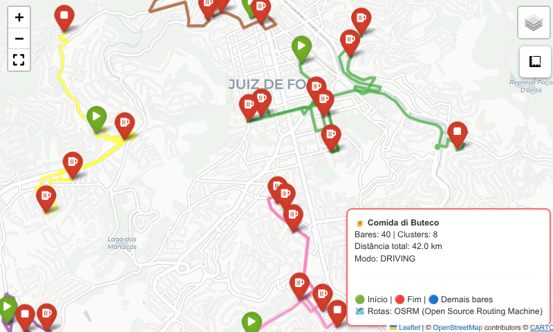

# Roteirizador com *Open Source Routing Machine*

### Introdução

No [primeiro](https://github.com/guiajf/roteirizador-osmnx) artigo da série, apresentamos as funcionalidades do pacote *Osmnx* em conjunto com *NetworkX*. No [segundo](https://github.com/guiajf/roteirizador-ors) artigo, introduzimos a **API** do *OpenRouteService* (**ORS**). Nesta terceira e última abordagem, adotamos *Open Source Routing Machine* (**OSRM**), uma solução de roteamento *open source* que opera sob o princípio de servidores públicos gratuitos, eliminando a necessidade de cadastro e chaves **API**. Esta característica mostrou-se extremamente vantajosa do ponto de vista operacional, simplificando drasticamente o fluxo de trabalho e removendo barreiras de entrada. 

O **OSRM** oferece precisão comparável à do *OpenRouteService*, com suporte aos modos de transporte *walking*, *driving* e *cycling*, e responde com tempos de requisição ligeiramente inferiores devido à sua arquitetura mais enxuta. A principal vantagem observada foi a confiabilidade: ao contrário do **ORS**, que impôs restrições de acesso via cabeçalho *Referer*, o **OSRM** funcionou imediatamente após a implementação, sem necessidade de configurações adicionais. 

Entretanto, o **OSRM** público possui limitações importantes: não oferece garantias de disponibilidade ou desempenho, pode sofrer *rate limiting* não documentado, e fornece menos metadados que o **ORS**, por exemplo, não retorna altitudes ou instruções detalhadas.

Além disso, a infraestrutura pública do **OSRM** é mantida pela comunidade e pode ficar sobrecarregada em horários de pico. Para o projeto do *Comida di Buteco*, que envolve 40 bares e cálculos de matrizes de distância de tamanho moderado, o **OSRM** mostrou-se a escolha mais equilibrada entre precisão, facilidade de uso e custo operacional, sendo particularmente adequado para máquinas com recursos limitados devido à sua arquitetura baseada em requisições pontuais.

### Bibliotecas

### Carregamos as seguintes bibliotecas:

- **pandas**: biblioteca fundamental para análise de dados em Python, oferece estruturas como DataFrame e Series para manipulação e análise de dados tabulares. Neste projeto, é utilizada para carregar e inspecionar a lista dos 40 bares participantes.

- **numpy**: pacote essencial para computação científica, fornece suporte a arrays multidimensionais e funções matemáticas de alto desempenho. Utilizado para operações de conversão de coordenadas e cálculos auxiliares.

- **folium**: biblioteca para visualização geoespacial interativa, baseada em *Leaflet.js*. Plugins *Fullscreen* e *MeasureControl* adicionam tela cheia e ferramenta de medição ao mapa. Utilizada para criar o mapa final com rotas e clusters.

- **sklearn.cluster.KMeans**: módulo para clustering baseado em centroides. Implementa o algoritmo *K-Means* para agrupamento de pontos por proximidade geográfica. Utilizado para dividir os 40 bares em clusters espacialmente coerentes.

- **math**: módulo da biblioteca padrão que fornece funções matemáticas fundamentais. Utilizado para implementar a função *Haversine* com as funções `radians`, `sin`, `cos`, `sqrt`, `atan2`.

- **requests**: biblioteca para requisições HTTP em Python. Utilizada para realizar chamadas à API pública do OSRM (Open Source Routing Machine) e obter rotas entre os bares.

- **json**: módulo da biblioteca padrão para manipulação de dados no formato JSON. Utilizado para processar as respostas da **API** do **OSRM**.

- **time**: módulo da biblioteca padrão para controle de temporização. Utilizado para implementar *rate limiting* entre requisições à API, respeitando intervalos de 0.5 segundos para não sobrecarregar o servidor público do OSRM.

- **pickle**: módulo da biblioteca padrão para serialização de objetos Python. Utilizado para implementar sistema de *cache* das rotas obtidas, evitando requisições repetidas e acelerando execuções futuras.

- **os**: módulo da biblioteca padrão para interface com o sistema operacional. Utilizado para verificar existência de arquivos de cache e manipular caminhos.

- **warnings**: módulo da biblioteca padrão para controle de mensagens de aviso. Utilizado para suprimir alertas técnicos e manter a saída limpa e focada nos resultados.


```python
import pandas as pd
import numpy as np
import folium
from folium.plugins import MeasureControl, Fullscreen
from sklearn.cluster import KMeans
from math import radians, sin, cos, sqrt, atan2
import requests
import json
import time
import pickle
import os
import warnings
warnings.filterwarnings('ignore')
```

### Configurações iniciais

Nesta seção, definimos os parâmetros fundamentais para a execução do roteirizador. Configuramos a **URL** do servidor público do **OSRM**, o modo de transporte (driving, walking ou cycling) e a distância máxima de deslocamento entre os bares, que é de 20 km. Diferentemente de outras soluções, o **OSRM** dispensa o uso de chaves de **API**, simplificando drasticamente o fluxo de trabalho.


```python
# Usando o servidor público do OSRM
OSRM_URL = "http://router.project-osrm.org"

# Modo de transporte: 'driving', 'walking', 'cycling'
MODO_OSRM = "driving"  
# Distância máxima
MAX_DISTANCE_KM = 20

print(f"\n⚙️ Configurações:")
print(f"   Servidor OSRM: {OSRM_URL}")
print(f"   Modo: {MODO_OSRM}")
print(f"   Distância máxima: {MAX_DISTANCE_KM} km")
print(f"   ✅ Sem necessidade de API Key!")

```

    
    ⚙️ Configurações:
       Servidor OSRM: http://router.project-osrm.org
       Modo: driving
       Distância máxima: 20 km
       ✅ Sem necessidade de API Key!


### Definimos a função *Haversine*

Implementamos a função de *Haversine*, que calcula a distância em linha reta (distância euclidiana esférica) entre dois pontos geográficos, expressa em metros. Esta função é utilizada como *fallback* sempre que a **API** do **OSRM** não consegue obter uma rota válida, garantindo a estabilidade do sistema.


```python
def haversine_distance(lat1, lon1, lat2, lon2):
    """Distância de Haversine em metros"""
    R = 6371000
    lat1, lon1, lat2, lon2 = map(radians, [lat1, lon1, lat2, lon2])
    dlat = lat2 - lat1
    dlon = lon2 - lon1
    a = sin(dlat/2)**2 + cos(lat1) * cos(lat2) * sin(dlon/2)**2
    c = 2 * atan2(sqrt(a), sqrt(1-a))
    return R * c

```

## Definimos a classe `OSRMClient`

Construímos uma classe dedicada para consumir a **API** do **OSRM**. Ela gerencia o *cache* local das rotas já calculadas, controla o intervalo entre requisições e implementa mecanismos de *retry* em caso de falhas transitórias. O *cache* é persistido em disco utilizando a biblioteca **pickle**, o que acelera execuções futuras e reduz a carga sobre o servidor público.


```python
class OSRMClient:
    """Cliente para a API OSRM (Open Source Routing Machine)"""
    
    def __init__(self, mode='driving'):
        self.mode = mode  # driving, walking, cycling
        self.base_url = "http://router.project-osrm.org"
        self.cache_file = f"osrm_cache_{mode}.pkl"
        self.last_request_time = 0
        self.request_interval = 0.5  # 2 requisições por segundo
        self.cache = self._load_cache()
    
    def _load_cache(self):
        if os.path.exists(self.cache_file):
            with open(self.cache_file, 'rb') as f:
                print(f"   📂 Cache carregado: {self.cache_file}")
                return pickle.load(f)
        return {}
    
    def _save_cache(self):
        with open(self.cache_file, 'wb') as f:
            pickle.dump(self.cache, f)
            print(f"   💾 Cache salvo: {self.cache_file}")
    
    def _wait_if_needed(self):
        elapsed = time.time() - self.last_request_time
        if elapsed < self.request_interval:
            time.sleep(self.request_interval - elapsed)
        self.last_request_time = time.time()
    
    def get_route_geometry(self, lat1, lon1, lat2, lon2, retry=3):
        """
        Obtém a geometria COMPLETA da rota entre dois pontos usando OSRM
        """
        # Verificar cache
        cache_key = f"route_{self.mode}_{lat1:.6f}_{lon1:.6f}_{lat2:.6f}_{lon2:.6f}"
        
        if cache_key in self.cache:
            cached_value = self.cache[cache_key]
            if cached_value and len(cached_value) > 2:
                return cached_value
            else:
                del self.cache[cache_key]
        
        # URL para OSRM (formato: /route/v1/{profile}/{lon1},{lat1};{lon2},{lat2}
        url = f"{self.base_url}/route/v1/{self.mode}/{lon1},{lat1};{lon2},{lat2}"
        
        params = {
            "geometries": "geojson",  # GeoJSON format
            "overview": "full",       # Geometria completa
            "steps": "false"          # Sem instruções passo a passo
        }
        
        for tentativa in range(retry):
            try:
                self._wait_if_needed()
                
                response = requests.get(url, params=params, timeout=30)
                
                if response.status_code == 200:
                    data = response.json()
                    
                    if 'routes' in data and len(data['routes']) > 0:
                        if 'geometry' in data['routes'][0]:
                            geometry = data['routes'][0]['geometry']['coordinates']
                            
                            if geometry and len(geometry) > 1:
                                # Converter de [lon, lat] para [lat, lon]
                                route_coords = [[coord[1], coord[0]] for coord in geometry]
                                
                                # Salvar em cache
                                self.cache[cache_key] = route_coords
                                self._save_cache()
                                
                                return route_coords
                            else:
                                print(f"      ⚠️ Geometria vazia")
                        else:
                            print(f"      ⚠️ Rota sem geometria")
                    else:
                        print(f"      ⚠️ Nenhuma rota encontrada")
                        
                elif response.status_code == 429:
                    print(f"      ⚠️ Rate limit, aguardando... (tentativa {tentativa+1}/{retry})")
                    time.sleep(2)
                    continue
                    
                else:
                    print(f"      ⚠️ Erro {response.status_code}: {response.text[:100]}")
                    if tentativa < retry - 1:
                        time.sleep(1)
                        continue
                    return None
                    
            except Exception as e:
                print(f"      ⚠️ Erro: {e}")
                if tentativa < retry - 1:
                    time.sleep(1)
                    continue
                return None
        
        return None
    
    def get_distance(self, lat1, lon1, lat2, lon2):
        """Obtém distância entre dois pontos em metros"""
        route = self.get_route_geometry(lat1, lon1, lat2, lon2)
        if route:
            # Calcular distância da geometria
            dist = 0
            for i in range(len(route)-1):
                dist += haversine_distance(route[i][0], route[i][1], route[i+1][0], route[i+1][1])
            return dist
        else:
            return haversine_distance(lat1, lon1, lat2, lon2)

```

### Carregamos os dados

Carregamos a base com os 40 bares participantes a partir de um arquivo *.csv*. Cada bar possui *nome*, *latitude* e *longitude*. Esta etapa valida a integridade dos dados e prepara a estrutura para as etapas seguintes de agrupamento e otimização de rotas.


```python
df_bares = pd.read_csv("lista_bares.csv")


print(f"✅ {len(df_bares)} bares carregados")
```

    ✅ 40 bares carregados


### Testamos a conexão

Executamos um teste rápido para verificar a disponibilidade e o correto funcionamento do servidor **OSRM** público. O teste calcula a rota entre os dois primeiros bares da lista. Em caso de sucesso, o sistema utiliza rotas reais, seguindo as vias; caso contrário, recai automaticamente sobre as distâncias *Haversine*, em linha reta, garantindo que a análise seja concluída mesmo sem conectividade.


```python
def testar_osrm():
    """Testa se o OSRM está funcionando"""
    print("\n🔍 Testando conexão com OSRM...")
    
    test_client = OSRMClient(mode=MODO_OSRM)
    
    # Usar dois bares reais
    bar1 = df_bares.iloc[0]
    bar2 = df_bares.iloc[1]
    
    print(f"   Testando: {bar1['Name']} → {bar2['Name']}")
    
    rota = test_client.get_route_geometry(
        bar1['latitude'], bar1['longitude'],
        bar2['latitude'], bar2['longitude']
    )
    
    if rota and len(rota) > 2:
        print(f"   ✅ OSRM funcionando! Rota obtida com {len(rota)} pontos")
        return True
    else:
        print(f"   ⚠️ OSRM não disponível. Usando apenas distâncias Haversine.")
        return False

OSRM_DISPONIVEL = testar_osrm()

```

    
    🔍 Testando conexão com OSRM...
       📂 Cache carregado: osrm_cache_driving.pkl
       Testando: ADEGA BAR → BAR DIAS
       ✅ OSRM funcionando! Rota obtida com 412 pontos


### Definimos a classe `RoteirizadorOSRM`

Esta é a classe central do projeto. Ela orquestra todo o processo: agrupa os bares utilizando o algoritmo *K-Means*, otimiza a ordem de visita dentro de cada *cluster* com uma heurística gulosa do vizinho mais próximo, resolvendo o *Problema do Caixeiro Viajante* aberto e gera mapas interativos com as rotas desenhadas sobre as ruas. A classe também produz relatórios detalhados com distâncias totais e a sequência sugerida para cada *cluster*.


```python
class RoteirizadorOSRM:
    def __init__(self, df_bares, distancia_max_km=15, modo='driving', usar_osrm=True):
        self.df_bares = df_bares.copy()
        self.distancia_max_metros = distancia_max_km * 1000
        self.modo = modo
        self.usar_osrm = usar_osrm
        
        if usar_osrm:
            self.osrm = OSRMClient(mode=modo)
        else:
            self.osrm = None
        
        self.cluster_routes = {}
        self.cluster_distances = {}
        self.cluster_geometries = {}
    
    def clusterizar(self):
        """Clusterização com K-Means"""
        print(f"\n📊 Clusterizando...")
        
        coords = self.df_bares[['latitude', 'longitude']].values
        
        # Calcular número de clusters
        dist_media = 0
        n_pares = 0
        for i in range(min(30, len(coords))):
            for j in range(i+1, min(30, len(coords))):
                dist_media += haversine_distance(coords[i,0], coords[i,1], coords[j,0], coords[j,1])
                n_pares += 1
        dist_media = dist_media / n_pares if n_pares > 0 else 500
        
        n_clusters = max(2, min(12, int(len(self.df_bares) / max(1, (self.distancia_max_metros / dist_media)))))
        print(f"   Distância média: {dist_media/1000:.2f}km")
        print(f"   Número de clusters: {n_clusters}")
        
        kmeans = KMeans(n_clusters=n_clusters, random_state=42, n_init=10)
        clusters = kmeans.fit_predict(coords)
        
        self.df_bares['cluster'] = clusters
        
        print(f"   ✅ {n_clusters} clusters formados")
        for c in range(n_clusters):
            n = sum(clusters == c)
            print(f"   📍 Cluster {c}: {n} bares")
        
        return self.df_bares
    
    def otimizar_cluster(self, cluster_data):
        """Otimiza rota para um cluster usando OSRM"""
        n = len(cluster_data)
        
        if n == 0:
            return [], 0.0, []
        
        if n == 1:
            return [cluster_data.iloc[0]['Name']], 0.0, []
        
        # Matriz de distâncias
        dist_matrix = np.zeros((n, n))
        route_geometries = {}
        
        print(f"   Calculando rotas com OSRM...")
        
        for i in range(n):
            for j in range(i+1, n):
                lat1, lon1 = cluster_data.iloc[i]['latitude'], cluster_data.iloc[i]['longitude']
                lat2, lon2 = cluster_data.iloc[j]['latitude'], cluster_data.iloc[j]['longitude']
                
                if self.usar_osrm and self.osrm:
                    route = self.osrm.get_route_geometry(lat1, lon1, lat2, lon2)
                    if route:
                        # Calcular distância real
                        dist = 0
                        for k in range(len(route)-1):
                            dist += haversine_distance(route[k][0], route[k][1], route[k+1][0], route[k+1][1])
                        route_geometries[(i, j)] = route
                        route_geometries[(j, i)] = route[::-1]
                    else:
                        dist = haversine_distance(lat1, lon1, lat2, lon2)
                else:
                    dist = haversine_distance(lat1, lon1, lat2, lon2)
                
                dist_matrix[i, j] = dist
                dist_matrix[j, i] = dist
        
        # TSP guloso
        visitados = [0]
        atual = 0
        distancia_total = 0.0
        geometrias_ordenadas = []
        
        while len(visitados) < n:
            melhor_dist = float('inf')
            melhor_idx = -1
            
            for j in range(n):
                if j not in visitados and dist_matrix[atual, j] > 0:
                    if dist_matrix[atual, j] < melhor_dist:
                        melhor_dist = dist_matrix[atual, j]
                        melhor_idx = j
            
            if melhor_idx != -1:
                if (atual, melhor_idx) in route_geometries:
                    geometrias_ordenadas.append({
                        'from': visitados[-1],
                        'to': melhor_idx,
                        'geometry': route_geometries[(atual, melhor_idx)]
                    })
                
                distancia_total += dist_matrix[atual, melhor_idx]
                visitados.append(melhor_idx)
                atual = melhor_idx
            else:
                break
        
        nomes = cluster_data['Name'].tolist()
        rota = [nomes[i] for i in visitados]
        
        return rota, distancia_total, geometrias_ordenadas
    
    def otimizar_todos_clusters(self):
        """Otimiza todos os clusters"""
        print("\n" + "="*60)
        print("🚀 OTIMIZANDO ROTAS COM OSRM")
        print("="*60)
        
        for cluster_id in sorted(self.df_bares['cluster'].unique()):
            cluster_data = self.df_bares[self.df_bares['cluster'] == cluster_id].reset_index(drop=True)
            print(f"\n📊 Cluster {cluster_id}: {len(cluster_data)} bares")
            
            rota, distancia, geometrias = self.otimizar_cluster(cluster_data)
            
            self.cluster_routes[cluster_id] = rota
            self.cluster_distances[cluster_id] = distancia
            self.cluster_geometries[cluster_id] = geometrias
            
            status = "✅" if distancia <= self.distancia_max_metros else "⚠️"
            print(f"   {status} Distância TOTAL: {distancia/1000:.3f} km")
            
            if len(rota) <= 5:
                print(f"   🍻 Rota: {' → '.join(rota)}")
            else:
                print(f"   🍻 Rota: {' → '.join(rota[:3])} ... → {rota[-1]}")
        
        return self.cluster_routes, self.cluster_distances
    
    def criar_mapa(self):
        """Cria mapa com todas as rotas"""
        
        center_lat = self.df_bares['latitude'].mean()
        center_lon = self.df_bares['longitude'].mean()
        
        m = folium.Map(location=[center_lat, center_lon], zoom_start=12, tiles='CartoDB positron')
        folium.TileLayer('CartoDB dark_matter', name='Mapa Escuro', show=False).add_to(m)
        
        cores = ['#e41a1c', '#377eb8', '#4daf4a', '#984ea3', '#ff7f00', 
                 '#ffff33', '#a65628', '#f781bf', '#999999', '#1b9e77']
        
        bares_info = {row['Name']: {'lat': row['latitude'], 'lon': row['longitude'], 'cluster': row['cluster']} 
                      for _, row in self.df_bares.iterrows()}
        
        for idx, cluster_id in enumerate(sorted(self.cluster_routes.keys())):
            cor = cores[idx % len(cores)]
            rota_nomes = self.cluster_routes.get(cluster_id, [])
            geometrias = self.cluster_geometries.get(cluster_id, [])
            
            fg = folium.FeatureGroup(name=f'Cluster {cluster_id}')
            
            # 1. Desenhar as rotas (seguindo as ruas)
            for rota_geo in geometrias:
                if 'geometry' in rota_geo and rota_geo['geometry']:
                    coords = [[lat, lon] for lat, lon in rota_geo['geometry']]
                    folium.PolyLine(
                        coords,
                        color=cor,
                        weight=4,
                        opacity=0.8
                    ).add_to(fg)
            
            # 2. Adicionar marcadores
            for i, nome in enumerate(rota_nomes):
                if nome in bares_info:
                    info = bares_info[nome]
                    
                    if i == 0:
                        cor_marcador = 'green'
                        icone = 'play'
                    elif i == len(rota_nomes) - 1:
                        cor_marcador = 'red'
                        icone = 'stop'
                    else:
                        cor_marcador = cor
                        icone = 'beer'
                    
                    popup = f"""
                    <b>{nome}</b><br>
                    📍 Parada {i+1} de {len(rota_nomes)}<br>
                    🍺 Cluster {cluster_id}
                    """
                    
                    folium.Marker(
                        [info['lat'], info['lon']],
                        popup=folium.Popup(popup, max_width=250),
                        icon=folium.Icon(color=cor_marcador, icon=icone, prefix='fa'),
                        tooltip=nome
                    ).add_to(fg)
            
            fg.add_to(m)
        
        folium.LayerControl().add_to(m)
        MeasureControl().add_to(m)
        Fullscreen().add_to(m)
        
        distancia_total = sum(self.cluster_distances.values())
        
        legenda = f'''
        <div style="position: fixed; bottom: 10px; right: 10px; z-index: 1000;
                    background: white; padding: 10px; border-radius: 8px;
                    border: 2px solid #FF6B6B; font-size: 12px;
                    box-shadow: 0 2px 5px rgba(0,0,0,0.2);">
            <b>🍺 Comida di Buteco</b><br>
            Bares: {len(self.df_bares)} | Clusters: {len(self.cluster_routes)}<br>
            Distância total: {distancia_total/1000:.1f} km<br>
            Modo: {self.modo.upper()}<br>
            <hr>
            🟢 Início | 🔴 Fim | 🔵 Demais bares<br>
            🗺️ Rotas: OSRM (Open Source Routing Machine)
        </div>
        '''
        m.get_root().html.add_child(folium.Element(legenda))
        
        return m
    
    def gerar_relatorio(self):
        """Gera relatório final"""
        print("\n" + "="*60)
        print("📋 RELATÓRIO FINAL - OSRM")
        print("="*60)
        print(f"Modo: {self.modo}")
        print(f"Limite: {self.distancia_max_metros/1000:.1f} km")
        print(f"Rotas reais: {'Sim' if self.usar_osrm else 'Não'}")
        
        distancia_total = sum(self.cluster_distances.values())
        print(f"\nTotal de bares: {len(self.df_bares)}")
        print(f"Total de clusters: {len(self.cluster_routes)}")
        print(f"Distância total: {distancia_total/1000:.2f} km")

```

### Finalizamos a rotina

Neste bloco, instanciamos o roteirizador com os parâmetros definidos e executamos as etapas sequenciais: clusterização, otimização das rotas por cluster e geração do relatório final. Ao final, criamos um mapa interativo que consolida visualmente todos os clusters e suas respectivas rotas, permitindo a inspeção geoespacial do resultado.


```python
# Criar roteirizador com OSRM
roteirizador = RoteirizadorOSRM(
    df_bares,
    distancia_max_km=MAX_DISTANCE_KM,
    modo=MODO_OSRM,
    usar_osrm=OSRM_DISPONIVEL  # Usa OSRM se disponível
)

# Executar
roteirizador.clusterizar()
roteirizador.otimizar_todos_clusters()
roteirizador.gerar_relatorio()

# Criar mapa
mapa = roteirizador.criar_mapa()
mapa.save('roteiro_osrm_final.html')
print(f"\n✅ Mapa salvo como 'roteiro_osrm_final.html'")
print("\n🎉 ANÁLISE CONCLUÍDA COM SUCESSO!")
```

       📂 Cache carregado: osrm_cache_driving.pkl
    
    📊 Clusterizando...
       Distância média: 4.41km
       Número de clusters: 8
       ✅ 8 clusters formados
       📍 Cluster 0: 5 bares
       📍 Cluster 1: 3 bares
       📍 Cluster 2: 9 bares
       📍 Cluster 3: 3 bares
       📍 Cluster 4: 2 bares
       📍 Cluster 5: 5 bares
       📍 Cluster 6: 6 bares
       📍 Cluster 7: 7 bares
    
    ============================================================
    🚀 OTIMIZANDO ROTAS COM OSRM
    ============================================================
    
    📊 Cluster 0: 5 bares
       Calculando rotas com OSRM...
       ✅ Distância TOTAL: 6.185 km
       🍻 Rota: BAR DIAS → BUDEGA DO PAPAI → LERO LERO → BAR DU BUNECO → COMPADRE GRILL COSTELARIA
    
    📊 Cluster 1: 3 bares
       Calculando rotas com OSRM...
       ✅ Distância TOTAL: 0.984 km
       🍻 Rota: BAR DO BREJO → COLISEUM BAR → NOSSO BAR JF
    
    📊 Cluster 2: 9 bares
       Calculando rotas com OSRM...
       💾 Cache salvo: osrm_cache_driving.pkl
       💾 Cache salvo: osrm_cache_driving.pkl
       💾 Cache salvo: osrm_cache_driving.pkl
       💾 Cache salvo: osrm_cache_driving.pkl
       💾 Cache salvo: osrm_cache_driving.pkl
       💾 Cache salvo: osrm_cache_driving.pkl
       ✅ Distância TOTAL: 11.326 km
       🍻 Rota: BAR DO ABILIO → CAMINHO DA ROCA → VARANDA RESTO BEER ... → EMPORIO DO SABOR
    
    📊 Cluster 3: 3 bares
       Calculando rotas com OSRM...
       ✅ Distância TOTAL: 2.165 km
       🍻 Rota: BAR DO TIAO → PETISQUEIRA → DON JUAN GASTRONOMIA E EVENTOS
    
    📊 Cluster 4: 2 bares
       Calculando rotas com OSRM...
       ✅ Distância TOTAL: 3.743 km
       🍻 Rota: ADEGA BAR → RECANTO DOS MANACAS
    
    📊 Cluster 5: 5 bares
       Calculando rotas com OSRM...
       ✅ Distância TOTAL: 6.962 km
       🍻 Rota: BAR DO ANTONIO → BAR DO JORGE → BUTECO DO PRINCIPE → BAR DO BENE → ZAKAS GASTRO BEER
    
    📊 Cluster 6: 6 bares
       Calculando rotas com OSRM...
       ✅ Distância TOTAL: 3.769 km
       🍻 Rota: BAR DO MARQUIM → BAR BATATA D'MOLA → REZA FORTE ... → BAR DO PASSARINHO
    
    📊 Cluster 7: 7 bares
       Calculando rotas com OSRM...
       ✅ Distância TOTAL: 6.873 km
       🍻 Rota: BAR TORRESMO → BAR SANTA MODERACAO → IBITIBAR ... → PAO MOIADO BAR
    
    ============================================================
    📋 RELATÓRIO FINAL - OSRM
    ============================================================
    Modo: driving
    Limite: 20.0 km
    Rotas reais: Sim
    
    Total de bares: 40
    Total de clusters: 8
    Distância total: 42.01 km
    
    ✅ Mapa salvo como 'roteiro_osrm_final.html'
    
    🎉 ANÁLISE CONCLUÍDA COM SUCESSO!


### Visualizamos o mapa interativo

Exibimos o mapa gerado diretamente no notebook. O mapa inclui camadas com as rotas coloridas por cluster, marcadores para cada bar e ferramentas interativas como medição de distâncias e tela cheia. Esta visualização permite validar a coerência espacial das rotas sugeridas e comunicar os resultados de forma clara e acessível.


```python
display(mapa)
```



**Considerações finais**

Este projeto desenvolveu um roteirizador para o concurso "Comida di Buteco" utilizando a *Open Source Routing Machine* (**OSRM**) como motor de cálculo de rotas. A solução proposta demonstrou ser tecnicamente viável e operacionalmente eficiente, combinando técnicas de agrupamento espacial com heurísticas para o *Problema do Caixeiro Viajante*, na variante aberta.

A implementação alcançou resultados satisfatórios nas quatro etapas fundamentais do roteirizador. Na etapa de clusterização, os 40 bares foram agrupados em 8 *clusters* geograficamente coerentes utilizando o algoritmo *K-Means*, o que permitiu segmentar o problema em subproblemas de menor escala. Em seguida, na otimização, a heurística do *vizinho mais próximo* resolveu o *Problema do Caixeiro Viajante aberto* dentro de cada *cluster*, gerando rotas otimizadas que respeitam a ordem de visita sugerida. Quanto à métrica de desempenho, a distância total percorrida foi de 42,0 km no modo de condução *driving*, valor compatível com a dispersão geográfica dos estabelecimentos. Por fim, na visualização, um mapa interativo gerado com a biblioteca **Folium** permite a inspeção geoespacial detalhada de todas as rotas, facilitando a validação dos resultados.

Acesse o mapa interativo em: https://guiajf.github.io/roteirizador-osrm/.


**Referências**

Bullock, R. *Great Circle Distances and Bearings Between Two Locations*, 2007. Disponível em: https://dtcenter.org/sites/default/files/community-code/met/docs/write-ups/gc_simple.pdf. Acesso em: 24 de maio 2026.

**Folium**. *Quickstart*. Folium Documentation, 2025. Disponível em: https://python-visualization.github.io/folium/latest/. Acesso em: 24 maio 2026.

Jünger, Michael; Reinelt, Gerhard; Rinaldi, Giovanni. *The Traveling Salesman Problem*. Köln: Universität zu Köln, Institut für Angewandte Mathematik und Informatik, fev. 1994. (Report No. 92.113). Disponível em: https://kups.ub.uni-koeln.de/54671/1/rep-92.113-koeln.pdf. Acesso em: 24 maio 2026.

Luu, Quang Trung; Aibin, Michal. *Traveling Salesman Problem: Exact Solutions vs. Heuristic vs. Approximation Algorithms*. Baeldung, 2024. Disponível em: https://www.baeldung.com/cs/tsp-exact-solutions-vs-heuristic-vs-approximation-algorithms. Acesso em: 24 maio 2026.

**OpenStreetMap**. *Routing*. OpenStreetMap Wiki, 2026. Disponível em: https://wiki.openstreetmap.org/wiki/Routing. Acesso em: 24 maio 2026.

**Scikit-Learn**. *K-means clustering*. Scikit-learn Documentation, 2026. Disponível em: https://scikit-learn.org/stable/modules/clustering.html#k-means. Acesso em: 24 maio 2026.

Veness, Chris. *Calculate distance, bearing and more between latitude/longitude points*, 2022. Disponível em: https://www.movable-type.co.uk/scripts/latlong.html. Acesso em: 24 maio 2026.


